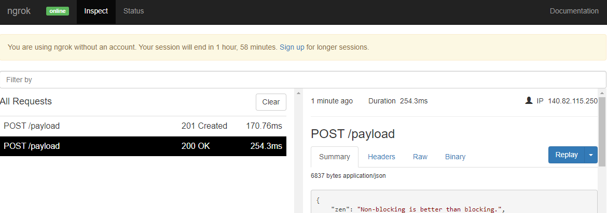

# OctoEvents

Octo Events is an application that listens to Github Events via webhooks and exposes an api for later use.  


# Prerequisites

## Docker

All you need to run Octo Events is Docker installed with docker-compose.

1. To install Docker follow the instructions [here](https://docs.docker.com/get-docker/);
2. Validate that you have docker compose installed and running:
```bash
$ docker-compose --version
# docker-compose version 1.28.5, build c4eb3a1f
```

## Test repository

We need a github test repository to validate that events triggers the webhook.

1. Login to your github account;
2. [Create](https://github.com/new) a new repository with a README;
3. Keep track of the test repository name, it will be needed later.

# Starting up

1. Clone this project:
```bash
$ git clone https://github.com/ricardoebbers/octo_events.git
```
2. Change into repository directory:
```bash
$ cd octo_events
```
3. Create the api, database and ngrok with docker-compose:
```bash
$ docker-compose up -d
# Creating network "octo_events_default" with the default driver
# Creating octo_events_db_1 ... done
# Creating octo_events_api_1 ... done
# Creating octo_events_ngrok_1 ... done
```
4. Go to the ngrok web interface at http://localhost:4551
5. Take note of the generated tunnel url:


## Configure Webhook

1. Create a new webhook for your test repository at `https://github.com/<your_github_username>/<your_test_repository>/settings/hooks/new` (you might need to confirm your github access, as you will be entering sudo mode)
2. On "payload URL" insert the generated tunnel url from ngrok, with the `/payload` suffix like this: `http://<ngrok_tunnel_url>/payload`;
3. On "Content type" select "application/json";
4. You can keep the "secret key" blank for now;
5. Check the "let me select individual events" radio button;
6. Check the "Issues" checkbox and **uncheck** "Pushes" checkbox;
7. Keep the "Active" checkbox checked;
8. Click on "Add Webhook" button;
9. Github sends a `ping` event when webhooks are created. On the Recent Deliveries section you should see an uuid with a green checkmark like this: 

# Testing

We should be all set up, so now we can test the service.

## Running tests

You can run all tests on the service by using mix:
```bash
$ mix test
```

## Validating that issue events are stored

1. Go to the test repository and create a new issue `https://github.com/<your_github_username>/<your_test_repository>/issues/new`;
2. Check http://localhost:4551. You should see something like this: 

The `POST /payload 200 OK` is from the `ping` event, and the `POST /payload 201 Created` is from the `issue opened` event

## Validating that other event types are discarded

1. Edit your webhook to send unhandled events like `pull requests`;
2. Create a pull request. You can edit the README file on the browser for simplicity.
3. Check http://localhost:4551 again, you should see:


## Listing stored events

The event payloads are relatively big. Considering that, I recommend using a REST client like Insomnia or Postman to make it easier to read, but you can use your browser too. 

1. Call GET `http://localhost:4000/issues` to see a list of issue ids that have events registered for them;
2. Pick one of the ids from the list and call GET `http://localhost:4000/issues/<issue_id>/events` to see all events for that issue.

# Wrapping up

Don't forget to stop and remove the containers:
```bash
$ docker-compose down --volumes --rmi local
```
